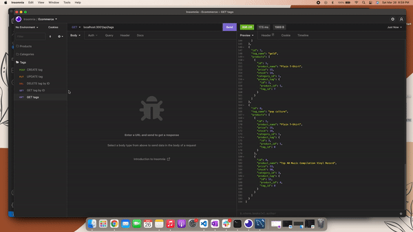

# E-commerce Back End 

  

Module 13: Object-Relational Mapping (ORM) Challenge: E-commerce Back End

## Description

E-commerce is the largest sector of the electronics industry and is becoming very popular in todays society. This challenge was to build the back end for an e-commerce website using Express.js API, Sequelize and MySQL databases. 

In the back end, you are able to create, update, read and delete data in the database from the different models created which are Products, Tags and Categories. 

## Table-of-Contents 
[Description](#description) -  
[Tutorial](#tutorial) - 
[Deployment](#deployment) - 
[Questions](#questions)

## Tutorial

Below is the demo walkthrough videos that demonstrate the functionality of the application and all of the POST, PUT and DELETE routes for products, tags and categories being tested in Insomnia.

* Create schema, seed data and start application


* GET routes for all categories, products and tags being tested in Insomnia


* GET routes for a single category, product and tag being tested in Insomnia


* POST, PUT & DELETE routes for products being tested in Insomnia


* POST, PUT & DELETE routes for categories being tested in Insomnia


* POST, PUT & DELETE routes for tags being tested in Insomnia



<!--  -->

## Deployment

To run the application: 

* Add .env file to the root of the app with the following information:

```
DB_NAME='ecommerce_db'
DB_USER='root'
DB_PW='xxx'
```
* Log into MySQL
* In MySQL, run `source db/schema.sql`
* Once the database is in MySQL, exit MySQL and run `npm run seed`
* Finally, to start the application run `npm start`


To see the Github page for this application, click [here](https://github.com/kelcmitch97/e-commerce):

## Questions

Please contact me using the following links: 

[GitHub](https://github.com/kelcmitch97)

[Email:](kelciemitchelmore@gmail.com) kelciemitchelmore@gmail.com

- - -
© 2021 Trilogy Education Services, LLC, a 2U, Inc. brand. Confidential and Proprietary. All Rights Reserved.

